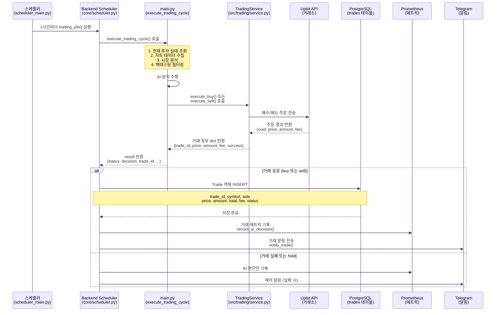

# 🔄 거래 기록 PostgreSQL 저장 로직 흐름도

> AI 자동매매 시스템의 거래 내역 저장 프로세스

**작성일**: 2025-12-28  
**상태**: ✅ 구현 완료 및 테스트 통과

---

## 📊 전체 로직 흐름



---

## 🔍 단계별 상세 설명

### 1단계: 스케줄러 시작 (scheduler_main.py)

**실행 주기**: 1시간마다 자동 실행

```python
# scheduler_main.py
start_scheduler()  # 스케줄러 시작
└─> add_jobs()
    └─> scheduler.add_job(trading_job, interval=60분)
```

---

### 2단계: 거래 작업 실행 (backend/app/core/scheduler.py)

**파일**: `backend/app/core/scheduler.py`

```python
async def trading_job():
    # 1. 서비스 초기화
    ticker = TradingConfig.TICKER
    upbit_client = UpbitClient()
    trading_service = TradingService(upbit_client)
    ai_service = AIService()
    
    # 2. 거래 사이클 실행
    result = await execute_trading_cycle(
        ticker, upbit_client, data_collector,
        trading_service, ai_service
    )
    
    # 3. PostgreSQL에 거래 기록 저장 (NEW!)
    if result['decision'] in ['buy', 'sell'] and result.get('trade_id'):
        async for db in get_db():
            trade = Trade(
                trade_id=result['trade_id'],
                symbol=ticker,
                side=result['decision'],
                price=Decimal(str(result['price'])),
                amount=Decimal(str(result['amount'])),
                total=Decimal(str(result['total'])),
                fee=Decimal(str(result['fee'])),
                status='completed' if result['trade_success'] else 'failed'
            )
            db.add(trade)
            await db.commit()
            break
```

**주요 변경 사항**:
- ✅ 매수/매도 성공 시 자동으로 PostgreSQL에 저장
- ✅ `trade_id` (Upbit 주문 UUID) 포함
- ✅ 거래 수수료 (`fee`) 기록
- ✅ 거래 상태 (`completed` / `failed`) 저장

---

### 3단계: 거래 실행 (main.py)

**파일**: `main.py`

```python
def _execute_ai_trading(...):
    decision = ai_result["decision"]
    trade_result = None
    
    if decision == "buy":
        trade_result = trading_service.execute_buy(ticker)  # dict 반환
    elif decision == "sell":
        trade_result = trading_service.execute_sell(ticker)  # dict 반환
    
    # AI 결과 + 거래 결과 병합
    result = {**ai_result}
    if trade_result:
        result.update({
            'trade_id': trade_result.get('trade_id'),
            'trade_success': trade_result.get('success'),
            'fee': trade_result.get('fee')
        })
    
    return result
```

**주요 변경 사항**:
- ✅ `execute_buy()`, `execute_sell()`이 이제 `dict` 반환 (기존 `bool`에서 변경)
- ✅ 거래 ID (`trade_id`)를 반환값에 포함
- ✅ 거래 성공 여부 (`trade_success`)와 수수료 (`fee`) 포함

---

### 4단계: TradingService 거래 실행 (src/trading/service.py)

**파일**: `src/trading/service.py`

#### 매수 실행

```python
def execute_buy(self, ticker: str) -> dict:
    """
    매수 실행
    
    Returns:
        {
            'success': bool,
            'trade_id': str,
            'price': float,
            'amount': float,
            'total': float,
            'fee': float,
            'error': str (optional)
        }
    """
    result = self.exchange.buy_market_order(ticker, buy_amount)
    
    if result:
        return {
            'success': True,
            'trade_id': result.get('uuid'),
            'price': float(result['price']),
            'amount': float(result['executed_volume']),
            'total': float(buy_amount),
            'fee': float(result.get('paid_fee'))
        }
    else:
        return {
            'success': False,
            'error': '매수 주문 실패'
        }
```

#### 매도 실행

```python
def execute_sell(self, ticker: str) -> dict:
    """
    매도 실행
    
    Returns:
        {
            'success': bool,
            'trade_id': str,
            'price': float,
            'amount': float,
            'total': float,
            'fee': float,
            'error': str (optional)
        }
    """
    result = self.exchange.sell_market_order(ticker, sell_volume)
    
    if result:
        trade_price = result['price']
        trade_volume = result['executed_volume']
        
        return {
            'success': True,
            'trade_id': result.get('uuid'),
            'price': float(trade_price),
            'amount': float(trade_volume),
            'total': float(trade_price * trade_volume),
            'fee': float(result.get('paid_fee'))
        }
    else:
        return {
            'success': False,
            'error': '매도 주문 실패'
        }
```

**주요 변경 사항**:
- ✅ 반환 타입 변경: `bool` → `dict`
- ✅ Upbit 주문 결과에서 거래 정보 추출
  - `uuid`: 거래 고유 ID
  - `price`: 체결 가격
  - `executed_volume`: 실제 체결 수량
  - `paid_fee`: 지불한 수수료
- ✅ 실패 시 에러 메시지 포함

---

### 5단계: PostgreSQL 저장 (backend/app/models/trade.py)

**테이블 구조**: `trades`

```python
class Trade(Base):
    """거래 내역 테이블"""
    __tablename__ = "trades"
    
    id: Mapped[int]                  # 자동 증가 ID
    trade_id: Mapped[str]            # Upbit UUID (unique)
    symbol: Mapped[str]              # KRW-ETH
    side: Mapped[str]                # buy / sell
    price: Mapped[Decimal]           # 체결 가격
    amount: Mapped[Decimal]          # 거래 수량
    total: Mapped[Decimal]           # 총 거래 금액
    fee: Mapped[Decimal]             # 거래 수수료
    status: Mapped[str]              # completed / failed
    created_at: Mapped[datetime]     # 거래 생성 시각
    updated_at: Mapped[datetime]     # 최종 업데이트 시각
```

**인덱스**:
- `trade_id` (unique)
- `symbol` + `created_at` (복합 인덱스)
- `status`

---

## 📈 데이터 흐름 예시

### 매수 거래 예시

```
1. AI 판단: buy (RSI 과매도 구간)
   ↓
2. TradingService.execute_buy("KRW-ETH")
   ↓
3. Upbit API 응답:
   {
     "uuid": "abc-123-def",
     "price": 4350000,
     "executed_volume": 0.0115,
     "paid_fee": 25.0
   }
   ↓
4. TradingService 반환:
   {
     "success": True,
     "trade_id": "abc-123-def",
     "price": 4350000.0,
     "amount": 0.0115,
     "total": 50000.0,
     "fee": 25.0
   }
   ↓
5. PostgreSQL INSERT:
   Trade(
     trade_id="abc-123-def",
     symbol="KRW-ETH",
     side="buy",
     price=4350000,
     amount=0.0115,
     total=50000,
     fee=25,
     status="completed"
   )
   ↓
6. Telegram 알림: "매수 주문 성공!"
```

---

## ✅ 테스트 결과

### 단위 테스트 (6개)

**파일**: `tests/backend/app/core/test_trade_recording.py`

```
✅ test_buy_trade_saves_to_database           - PASSED
✅ test_sell_trade_saves_to_database          - PASSED
✅ test_hold_decision_does_not_save_trade     - PASSED
✅ test_failed_trade_does_not_save            - PASSED
✅ test_execute_buy_returns_trade_details     - PASSED
✅ test_execute_sell_returns_trade_details    - PASSED
```

**결과**: **6 passed** in 1.76s ✅

---

## 🔍 주요 개선 사항

### Before (기존 구조)

```python
# TradingService
def execute_buy(self, ticker: str) -> bool:
    result = self.exchange.buy_market_order(...)
    return True  # ❌ 거래 정보 손실

# Scheduler
if result['decision'] == 'buy':
    # ❌ DB 저장 로직 없음
    notify_trade(...)
```

**문제점**:
- ❌ 거래 ID (`trade_id`)를 DB에 저장하지 않음
- ❌ 거래 내역 추적 불가능
- ❌ 수익/손실 계산 불가능
- ❌ 백테스팅 결과와 실거래 비교 불가

---

### After (개선된 구조)

```python
# TradingService
def execute_buy(self, ticker: str) -> dict:
    result = self.exchange.buy_market_order(...)
    return {
        'success': True,
        'trade_id': result['uuid'],  # ✅ Upbit UUID 포함
        'price': result['price'],
        'amount': result['executed_volume'],
        'fee': result['paid_fee']
    }

# Scheduler
if result['decision'] == 'buy' and result.get('trade_id'):
    # ✅ PostgreSQL에 저장
    async for db in get_db():
        trade = Trade(
            trade_id=result['trade_id'],
            symbol=ticker,
            side='buy',
            ...
        )
        db.add(trade)
        await db.commit()
```

**개선 사항**:
- ✅ 모든 거래 내역이 PostgreSQL에 자동 저장
- ✅ Upbit 주문 UUID로 거래 추적 가능
- ✅ 거래 수수료까지 정확히 기록
- ✅ Backend API (`GET /api/v1/trades/`)로 조회 가능
- ✅ Grafana 대시보드에서 거래 통계 시각화 가능

---

## 📚 관련 문서

- **[모니터링 가이드](./MONITORING_GUIDE.md)** - 전체 모니터링 시스템
- **[시스템 기능명세서](./SYSTEM_SPECIFICATION.md)** - 시스템 동작 방식
- **[스케줄러 가이드](./SCHEDULER_GUIDE.md)** - 자동 거래 스케줄링
- **[Backend API 문서](http://localhost:8000/docs)** - `/api/v1/trades/` 엔드포인트

---

**작성일**: 2025-12-28  
**작성자**: AI Assistant  
**상태**: ✅ 구현 완료 및 테스트 통과 (6/6 tests passed)


