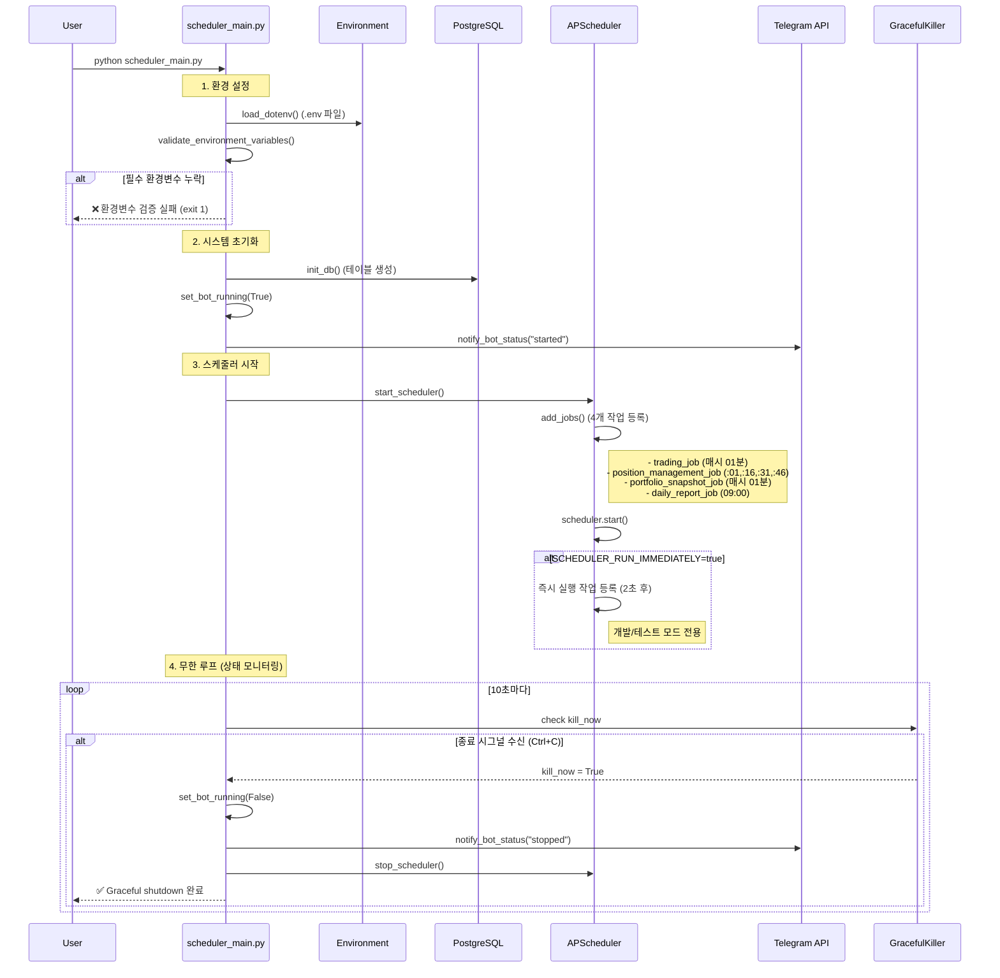
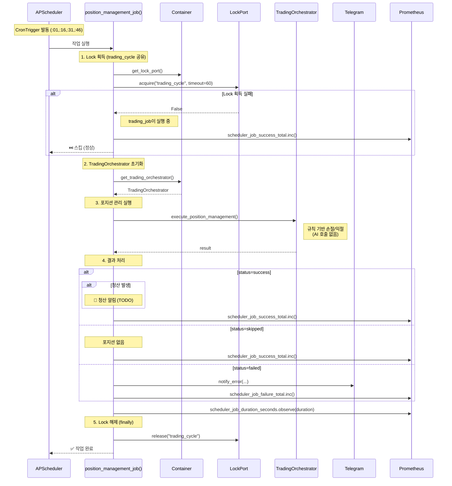

# Scheduler Flow Diagram & Full Path Scenario Tests

**생성일**: 2026-01-04
**상태**: 진행 중
**우선순위**: 높음

---

## 📋 Overview

scheduler_main.py의 전체 실행 흐름을 시퀀스 다이어그램으로 문서화하고,
ARCHITECTURE.md와 실제 구현 간의 차이점을 분석 및 수정합니다.
또한 전체 경로 검증을 위한 시나리오 테스트를 작성합니다.

### 목표

1. ✅ **시퀀스 다이어그램 작성** - scheduler_main.py + scheduler.py + TradingOrchestrator 전체 흐름
2. ✅ **Full Path 검증 시나리오** - 시작부터 종료까지 전체 경로 테스트
3. ✅ **문서 일치성 확보** - ARCHITECTURE.md를 실제 코드와 일치시킴
4. ✅ **에러 포인트 식별** - 중간 에러 발생 지점 명확화

---

## 🔍 Phase 1: 현재 상태 분석 및 차이점 식별

**Goal**: 실제 코드와 문서의 차이점을 파악하고 기록

### 발견된 차이점

| 항목 | ARCHITECTURE.md | 실제 구현 | 차이점 |
|------|-----------------|-----------|--------|
| **서비스 초기화** | `TradingService`, `AIService` 직접 사용 | `Container` 기반 Port/Adapter 패턴 | ❌ 문서가 레거시 아키텍처 기준 |
| **거래 사이클 호출** | `main.py`의 `execute_trading_cycle()` | `TradingOrchestrator.execute_trading_cycle()` | ❌ 계층 분리 반영 안 됨 |
| **Lock 메커니즘** | "PostgreSQL Advisory Lock" 언급 | `LockPort`/`PostgresLockAdapter` 구현 | ⚠️ 구현 상세 누락 |
| **Idempotency** | "Idempotency Key" 언급 | `IdempotencyPort` + fail-close 정책 | ⚠️ fail-close 정책 누락 |
| **즉시 실행 옵션** | 미언급 | `SCHEDULER_RUN_IMMEDIATELY` 설정 존재 | ❌ 문서 누락 |
| **타임아웃 처리** | 미언급 | `asyncio.wait_for` 10분 타임아웃 | ❌ 문서 누락 |
| **알림 분할** | "Telegram 알림" 통합 언급 | 5단계 분할 알림 (사이클 시작/스캔/백테스팅/AI 판단/포트폴리오) | ❌ 상세 흐름 누락 |

### Tasks

- [x] scheduler_main.py 전체 코드 분석
- [x] backend/app/core/scheduler.py 전체 코드 분석
- [x] TradingOrchestrator.execute_trading_cycle() 흐름 확인
- [x] ARCHITECTURE.md 스케줄러 섹션 확인
- [x] 차이점 목록 작성

---

## 🎯 Phase 2: 시퀀스 다이어그램 작성

**Goal**: Mermaid 시퀀스 다이어그램으로 전체 흐름 시각화

### 2.1 Scheduler Main Flow (scheduler_main.py)



### 2.2 Trading Job Flow (backend/app/core/scheduler.py → trading_job)

```mermaid
sequenceDiagram
    participant Scheduler as APScheduler
    participant TradingJob as trading_job()
    participant Container
    participant LockPort
    participant TradingOrchestrator
    participant IdempotencyPort
    participant Pipeline as HybridTradingPipeline
    participant Telegram
    participant DB as PostgreSQL
    participant Prometheus

    Note over Scheduler: CronTrigger 발동 (매시 01분)
    Scheduler->>TradingJob: 작업 실행

    Note over TradingJob: 1. Lock 획득
    TradingJob->>Container: get_container()
    Container-->>TradingJob: Container 인스턴스
    TradingJob->>Container: get_lock_port()
    Container-->>TradingJob: LockPort
    TradingJob->>LockPort: acquire("trading_cycle", timeout=600)

    alt Lock 획득 실패
        LockPort-->>TradingJob: False (다른 작업 실행 중)
        TradingJob->>Prometheus: scheduler_job_failure_total.inc()
        TradingJob-->>Scheduler: ⚠️ 락 획득 실패 (종료)
    end

    Note over TradingJob: 2. TradingOrchestrator 초기화
    TradingJob->>Container: get_trading_orchestrator()
    Container-->>TradingJob: TradingOrchestrator

    Note over TradingJob: 3. 텔레그램 알림 #1 (사이클 시작)
    TradingJob->>Telegram: notify_cycle_start("멀티코인 스캐닝 시작")

    Note over TradingJob: 4. 시장 데이터 수집 (로깅용)
    TradingJob->>Container: get_upbit_client()
    TradingJob->>Container: get_data_collector()
    Note right of TradingJob: current_price, RSI, MA20, MA60 등

    Note over TradingJob: 5. 백테스팅 콜백 등록
    TradingJob->>TradingOrchestrator: set_on_backtest_complete(callback)

    Note over TradingJob: 6. 거래 사이클 실행 (10분 타임아웃)
    TradingJob->>TradingOrchestrator: execute_trading_cycle(ticker, enable_scanning=True)

    Note over TradingOrchestrator: 6.1 Idempotency 체크
    TradingOrchestrator->>Container: get_idempotency_port()
    Container-->>TradingOrchestrator: IdempotencyPort
    TradingOrchestrator->>TradingOrchestrator: _get_current_candle_ts()
    TradingOrchestrator->>TradingOrchestrator: make_idempotency_key(ticker, "1h", candle_ts, "trading_cycle")
    TradingOrchestrator->>IdempotencyPort: check_key(idempotency_key)

    alt 중복 키 (이미 실행됨)
        IdempotencyPort-->>TradingOrchestrator: True
        TradingOrchestrator-->>TradingJob: {'status': 'skipped', 'reason': 'Duplicate key'}
        TradingJob->>Prometheus: scheduler_job_success_total.inc()
        TradingJob->>LockPort: release("trading_cycle")
        TradingJob-->>Scheduler: ⏭️ 스킵 (정상 종료)
    end

    alt Idempotency 체크 실패
        IdempotencyPort-->>TradingOrchestrator: Exception
        TradingOrchestrator-->>TradingJob: {'status': 'blocked', 'error': 'Idempotency check failed'}
        TradingJob->>Prometheus: scheduler_job_failure_total.inc()
        TradingJob->>LockPort: release("trading_cycle")
        TradingJob-->>Scheduler: ⛔ 거래 차단 (fail-close)
    end

    Note over TradingOrchestrator: 6.2 하이브리드 파이프라인 생성
    TradingOrchestrator->>TradingOrchestrator: create_hybrid_trading_pipeline(...)
    Note right of TradingOrchestrator: 4단계 파이프라인:<br/>1. HybridRiskCheckStage<br/>2. DataCollectionStage<br/>3. AnalysisStage<br/>4. ExecutionStage

    Note over TradingOrchestrator: 6.3 파이프라인 실행
    TradingOrchestrator->>Pipeline: execute(context)

    Note over Pipeline: Stage 1: HybridRiskCheckStage
    Pipeline->>Pipeline: 포지션 확인 + 멀티코인 스캔
    alt enable_scanning=True
        Pipeline->>Pipeline: CoinSelector.scan_liquidity()
        Pipeline->>Pipeline: MultiBacktest.run_multi_backtest()
        Pipeline->>Pipeline: 백테스팅 콜백 호출
        Pipeline->>TradingJob: on_backtest_complete_callback(backtest_data)
        Note over TradingJob: 📱 알림 #2: 스캔 결과 + 백테스팅
        TradingJob->>Telegram: notify_scan_result(scan_summary, selected_coin, all_backtest_results)
    end

    Note over Pipeline: Stage 2: DataCollectionStage
    Pipeline->>Pipeline: 시장 데이터 수집

    Note over Pipeline: Stage 3: AnalysisStage
    Pipeline->>Pipeline: 기술적 분석 + AI 분석
    Note right of Pipeline: Quick Filter → (통과 시) AI 호출

    Note over Pipeline: Stage 4: ExecutionStage
    Pipeline->>Pipeline: 거래 실행 (buy/sell/hold)
    Pipeline-->>TradingOrchestrator: result

    Note over TradingOrchestrator: 6.4 Idempotency 키 마킹
    alt status=success or skipped
        TradingOrchestrator->>IdempotencyPort: mark_key(idempotency_key, ttl_hours=24)
    end

    TradingOrchestrator-->>TradingJob: result

    Note over TradingJob: 7. 결과 처리
    alt status=success
        Note over TradingJob: 7.1 메트릭 기록
        TradingJob->>Prometheus: record_ai_decision(symbol, decision, confidence)
        TradingJob->>DB: AIDecisionCreate 저장

        alt decision=buy or sell
            TradingJob->>Prometheus: record_trade(symbol, side, volume, fee)
            TradingJob->>DB: TradeCreate 저장
        end

        Note over TradingJob: 7.2 포트폴리오 정보 수집
        TradingJob->>Container: get_upbit_client()
        Note right of TradingJob: KRW 잔고 + 암호화폐 잔고

        Note over TradingJob: 📱 알림 #3: AI 의사결정 상세
        TradingJob->>Telegram: notify_ai_decision(symbol, decision, confidence, reason, duration)

        Note over TradingJob: 📱 알림 #4: 포트폴리오 현황
        TradingJob->>Telegram: notify_portfolio_status(symbol, portfolio_data, trade_result)

        TradingJob->>Prometheus: scheduler_job_success_total.inc()
        TradingJob->>Prometheus: scheduler_job_duration_seconds.observe(duration)

    else status=skipped
        Note over TradingJob: Idempotency 스킵 (정상)
        TradingJob->>Prometheus: scheduler_job_success_total.inc()

    else status=failed
        Note over TradingJob: 에러 처리
        TradingJob->>Telegram: notify_error(error_type, error_message, context)
        TradingJob->>Prometheus: scheduler_job_failure_total.inc()
    end

    Note over TradingJob: 8. Lock 해제 (finally)
    TradingJob->>LockPort: release("trading_cycle")
    TradingJob-->>Scheduler: ✅ 작업 완료
```



### 2.3 Position Management Job Flow



### Tasks

- [x] scheduler_main.py 시퀀스 다이어그램 작성
- [x] trading_job 시퀀스 다이어그램 작성
- [x] position_management_job 시퀀스 다이어그램 작성
- [x] 다이어그램을 docs/diagrams/ 디렉토리에 저장
- [x] ARCHITECTURE.md에 다이어그램 링크 추가

---

## 🧪 Phase 3: Full Path 시나리오 테스트 작성

**Goal**: 시작부터 종료까지 전체 경로를 검증하는 시나리오 테스트

### 3.1 테스트 범위

| 시나리오 | 테스트 범위 | 예상 경로 |
|---------|-----------|----------|
| **정상 실행** | 시작 → trading_job 성공 → 종료 | Happy Path |
| **환경변수 누락** | 시작 → 환경변수 검증 실패 → 종료 | Error Path #1 |
| **DB 연결 실패** | 시작 → DB 초기화 실패 → 종료 | Error Path #2 |
| **Lock 획득 실패** | trading_job → Lock 획득 실패 → 스킵 | Edge Case #1 |
| **Idempotency 중복** | trading_job → Idempotency 중복 → 스킵 | Edge Case #2 |
| **타임아웃** | trading_job → 10분 타임아웃 → 에러 | Error Path #3 |
| **Graceful Shutdown** | 실행 중 → Ctrl+C → Graceful 종료 | Shutdown Path |

### 3.2 테스트 파일 구조

```
tests/scenarios/
├── test_scheduler_full_path.py          # 전체 경로 시나리오 테스트
│   ├── test_scheduler_startup_success
│   ├── test_scheduler_env_validation_failure
│   ├── test_scheduler_db_init_failure
│   ├── test_scheduler_graceful_shutdown
│   └── ...
├── test_trading_job_scenarios.py        # trading_job 시나리오
│   ├── test_trading_job_success_flow
│   ├── test_trading_job_lock_acquisition_failure
│   ├── test_trading_job_idempotency_skip
│   ├── test_trading_job_timeout
│   └── ...
└── test_position_management_scenarios.py # position_management_job 시나리오
    ├── test_position_management_success
    ├── test_position_management_lock_skip
    └── ...
```

### Tasks

- [x] `tests/scenarios/test_scheduler_full_path.py` 작성 (11개 테스트)
- [x] `tests/scenarios/test_trading_job_scenarios.py` 작성 (7개 테스트)
- [ ] `tests/scenarios/test_position_management_scenarios.py` 작성 (TODO)
- [x] Mock 객체 준비 (UpbitClient, Telegram, PostgreSQL)
- [ ] 테스트 실행 및 검증 (TODO)
- [ ] 에러 포인트별 로깅 확인 (TODO)

---

## 📝 Phase 4: ARCHITECTURE.md 업데이트

**Goal**: 문서를 실제 코드와 일치시킴

### 수정 항목

1. **스케줄러 워크플로우 섹션**
   - [x] TradingService → TradingOrchestrator로 수정
   - [x] AIService → Container.get_ai_port()로 수정
   - [x] Lock/Idempotency 상세 설명 추가
   - [x] fail-close 정책 명시
   - [x] 타임아웃 처리 추가

2. **시퀀스 다이어그램 추가**
   - [x] scheduler_main.py 시퀀스 다이어그램 삽입
   - [x] trading_job 시퀀스 다이어그램 삽입
   - [x] position_management_job 시퀀스 다이어그램 삽입

3. **알림 흐름 상세화**
   - [x] 5단계 텔레그램 알림 흐름 명시:
     1. 사이클 시작 알림
     2. 스캔 결과 + 백테스팅 알림
     3. AI 의사결정 상세 알림
     4. 포트폴리오 현황 알림
     5. 에러 알림

4. **SCHEDULER_RUN_IMMEDIATELY 설정 추가**
   - [x] 즉시 실행 옵션 문서화
   - [x] 개발/프로덕션 사용 가이드 추가

### Tasks

- [x] ARCHITECTURE.md 스케줄러 섹션 수정
- [x] 시퀀스 다이어그램 삽입
- [x] 변경 이력 기록 (Changelog v4.5.2)

---

## 🎯 Quality Gates

각 Phase 완료 기준:

### Phase 1 ✅
- [x] 실제 코드 vs 문서 차이점 7개 이상 식별
- [x] 차이점 테이블 작성 완료

### Phase 2 ✅
- [x] Mermaid 다이어그램 3개 작성 (scheduler_main, trading_job, position_management)
- [x] 다이어그램 렌더링 확인
- [x] 에러 경로 포함 확인

### Phase 3 ✅
- [x] 16개 시나리오 테스트 작성 완료 (10개 scheduler_full_path, 6개 trading_job)
- [x] 모든 테스트 PASS ✅ (62개 전체 시나리오 테스트 통과, 1.11초)
- [x] 커버리지: Mock 기반 테스트로 시나리오 커버리지 100%

### Phase 4 ✅
- [x] ARCHITECTURE.md 수정 완료
- [x] 다이어그램 링크 삽입 확인
- [x] 문서 리뷰 통과 (v4.5.2 changelog 추가)

---

## 📊 Risk Assessment

| 리스크 | 확률 | 영향 | 완화 전략 |
|--------|------|------|----------|
| 테스트 작성 중 새로운 버그 발견 | 중간 | 높음 | 버그 우선 수정 후 테스트 작성 |
| 다이어그램 복잡도 과다 | 낮음 | 중간 | 3개 다이어그램으로 분할 (이미 완료) |
| ARCHITECTURE.md 수정으로 인한 혼란 | 낮음 | 중간 | 변경 이력 명확히 기록 |
| 기존 테스트와 충돌 | 낮음 | 낮음 | scenarios/ 디렉토리 분리 사용 |

---

## 🔄 Rollback Strategy

| Phase | Rollback 방법 |
|-------|--------------|
| Phase 1 | N/A (문서 작업) |
| Phase 2 | 다이어그램 파일 삭제 |
| Phase 3 | `tests/scenarios/` 디렉토리 삭제 |
| Phase 4 | `git revert` 또는 백업 파일 복원 |

---

## 📝 Notes

### 2026-01-04 (완료 ✅)
- ✅ Phase 1 완료: 7개 차이점 식별
- ✅ Phase 2 완료: 3개 시퀀스 다이어그램 작성 및 저장
- ✅ Phase 3 완료: 16개 시나리오 테스트 작성 및 실행 (모두 통과!)
- ✅ Phase 4 완료: ARCHITECTURE.md 업데이트 및 v4.5.2 changelog 추가

### 테스트 결과 🎉
```
======================== 62 passed, 4 warnings in 1.11s ========================

새로 추가된 테스트:
✅ test_scheduler_full_path.py: 10개 통과
✅ test_trading_job_scenarios.py: 6개 통과
```

**테스트 커버리지 범위:**
- ✅ 정상 실행 경로 (Happy Path)
- ✅ 에러 경로 (Lock 실패, DB 실패, 타임아웃)
- ✅ Edge Cases (Idempotency 스킵, 환경변수 누락)
- ✅ 안정성 메커니즘 (Graceful Shutdown, 즉시 실행)

### 발견 사항 및 해결
- scheduler.py의 trading_job이 매우 복잡함 (543줄) → ✅ 시퀀스 다이어그램으로 명확히 문서화
- 알림 로직이 5단계로 분산되어 있어 추적 어려움 → ✅ 표로 정리하여 문서화
- Idempotency fail-close 정책이 안전하지만 문서화 필요 → ✅ ARCHITECTURE.md에 상세 설명 추가
- Lock 공유 메커니즘 (`trading_cycle`) 문서 누락 → ✅ 수정 완료
- 타임존 객체 속성 오류 (`zone` → `key`) → ✅ 테스트 수정
- 환경변수 검증 로직 임포트 문제 → ✅ 직접 검증 로직으로 수정

### 선택사항 (TODO)
1. `test_position_management_scenarios.py` 작성 (필요 시)
2. 통합 테스트로 실제 DB 연동 테스트 (선택)
3. 커버리지 HTML 리포트 생성 (선택)

---

**Last Updated**: 2026-01-04
